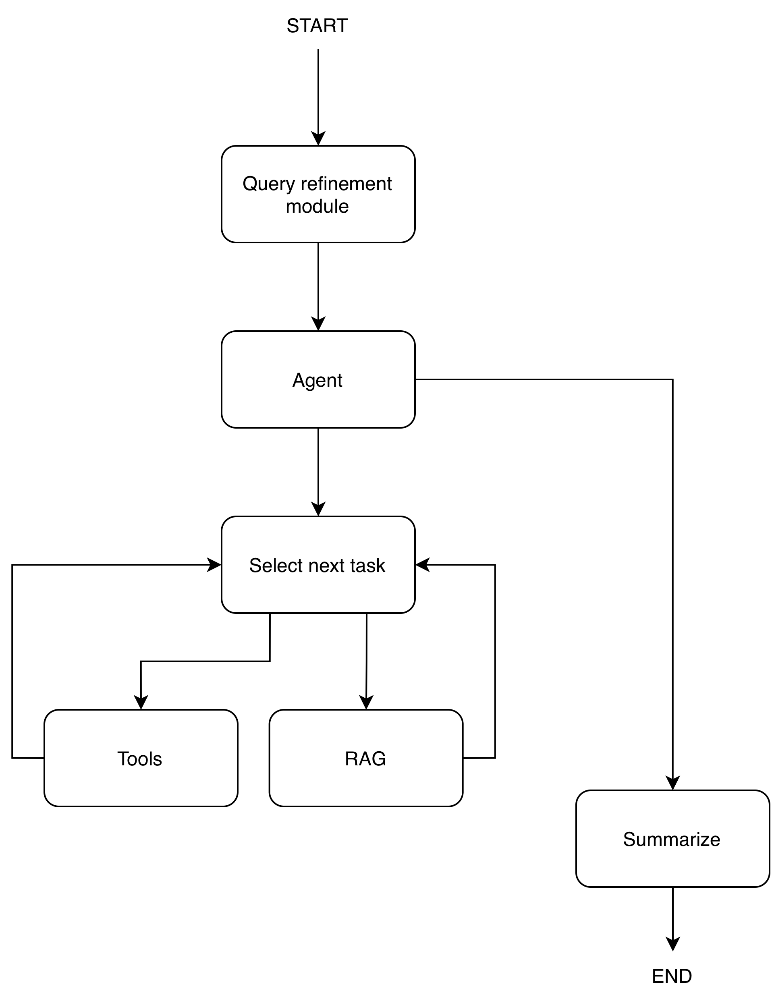

# Rag Chatbot Practice

## Goal of the project:

This exercise is about an imaginary agentic financial/company information system where users can ask about the top 10 biggest companies in the world and retrieve their current stock prices. 

## Quick start:

### 0. Prerequisites:

1. The project is managed by `uv`. Install it [here](https://docs.astral.sh/uv/getting-started/installation/).

2. Also, download `Docker` from [here](https://docs.docker.com/get-started/get-docker/) if you want to use the dockerized version of the application.

There are two ways to set up the environment. I created a tiny `run.sh` which sets up and starts the `streamlit` application. Please note that it downloads the source database from github releases and overwrites the existing database path.

### 1. Natively on your local machine:

```run.sh --local```

### 2. Docker:

```run.sh --docker```

### 3. Evaluation:
```./run.sh --local --performance-test```  
```./run.sh --local --eval```

## Practice requirements:
The practice is about creating an agentic RAG chatbot. The system requirements are the following:
- Python - Langgraph
- Reproducible results and system
- At least 5 nodes:
    - Autonomous decision
    - Problem solving by dividing the problem to subproblems and solve them individually
    - State handling between nodes
- At least two tools; not just simple search
- RAG Sub graph system besides the 5 nodes
- Data handling:
    - Free sources can be used: PDFs, open datasets, articles
- LLM restrictions: No paid APIs, open LLMs needed to be used or dummy LLMs. 
- Streamlit for UI
- System evaluation

### Project Delivery:
- This git repository
- Dockerfile
- Readme.md: 
    - Initial problem and goals
    - System design and the why
    - Evaluation results
    - Install and run

### Project evaluation:
- Source code readability and quality
- Reproducible results
- Problem relevance and choice
- Agentic architecture and Langgraph usage
- Evaluation method and results
- Depth of the evaluation

### Questions to be answered:
- Why is the problem relevant?
- What users will use and what it needs to satisfy?
- Why RAG is a solution for this?
- State why that LLM was chosen in this solution.
- System evaluation:
    - Functional:
        - 10-20 fixed queries in the system and evaluate at least one node.
    - Performance:
        - Latency metrics
        - Where is the bottleneck in the system?
        - Optimization points
- Why is this system design?


## Repo design and help for the review:
The project is organized into different modules and subdirectories. Let's see them one-by-one:

`src`: The whole project source code is inside this directory. 
Contains:
1. `config.py` responsible for the `.env` configuration load.
2. `main.py` is the main of the streamlit app which initializes and starts it.
3. `upload.py` is the tool to create the RAG vectorized database.  

There are additional directories inside `src` which are the different modules of the RAG system.  
1. `backend/data` contains the vector db helper functions and the db class itself.
2. `backend/graph` the heart of the application. This is where the agentic graph and their exact functions defined.
3. `backend/tools` contains the tools for the agentic system.
4. `backend/utils` keeps a decorator inside which measures the functions/modules of the application.
5. `eval` contains the performance tools.
6. `ui` responsible for the streamlit UI module. It has a backendconnector part which helps for the streamlit UI to communicate with the backend.

## System evaluation:

The repo contains an end-to-end latency metric and the agent module/planner evaluator and my results. More details [here](/src/eval/README.md).

## Answers to the questions:
- Why is the problem relevant?  
Because in our modern world proper investing is really important. Simple AI can hallucinate about the companies that users are wondering about, so a RAG system could mitigate it.

- What users will use and what it needs to satisfy?  
People who want to collect fast, relevant and grounded information about companies which they want to explore. 

- Why is RAG is a solution for this?  
Because RAG helps to mitigate hallucinations of LLMs. To do this, it retrieves relevant document sources based on the user query and helps to form a grounded/structured answer to it.

- State why that LLM was chosen in this solution.  
A `gemma3:4b` local SLM was chosen. I wanted a small model that could run locally with reasonable resource requirements. Since both grounding on retrieved documents and inference time are important for this use case I considered using the `4b` model. [Google's benchmarks](https://ai.google.dev/gemma/docs/core/model_card_3) show that this model is a reasonable choice. I would still benchmark this model against other SLMs in the financial domain though.

- System evaluation:
    - Functional:
        - 10-20 fixed queries in the system and evaluate at least one node.
    - Performance:
        - Latency metrics
        - Where is the bottleneck in the system?
        - Optimization points.  

Please see the system evaluation results and my answers [here](/src/eval/README.md)

- Why is this system design?  


Overall:  
I wanted the simplest MVP which later can be iterated on based on the evaluations and user feedback. Additionally, simplicity means grounding and safety; Many systems could drift by time and we can easily introduce safety issues too with to introduce unnecessary modules in early stages. Each improvement step requires full focus and planning before. Devs shall know what they introduce and implement into the system and how to use those.

In detail:  
For an agentic system we need separated and well defined modules. I separated the main graph into `6` main nodes:
1. `User query refiner`
2. `Agent`
3. `Next task selector`
4. `Tools`
5. `RAG`
6. `Summarization`

Processing flow:
- When the user asks something, the query refiner module gets the query, sees the user conversation history, and based on this information it refines the query if needed. 
- Then the agent decomposes user queries into smaller sub tasks.
- The next task selector checks the current sub task and delegates to the corresponding sub-graph: `RAG` or `TOOLS`.
- After each sub-task is completed, the system checks whether needed to continue the additional sub-task or create an additional plan or go and answer to the user.

This design keeps the whole system simple and maintainable. Individual
components can be evaluated and replaced independently as the system evolves.

## Manual run:
First, you need to create and use a virtual environment:
1. `uv .venv venv`
2. `source .venv/bin/activate`

Then,
### Database creation:
- `uv run python -m src.upload`

### Plot database vectors (Don't forget to create a vector db first :-) ):
- `uv run python -m src.backend.data.plot`

### System evaluation:
Agentic module evaluation:
- `uv run python -m src.eval.eval`  

Module latencies:
- `uv run python -m src.eval.performance_test`

### Streamlit app: 
- ```uv run python -m streamlit run src/main.py```

## AI USAGE STATEMENT:
I used a generative AI-based tool to complete the homework.

1. I used AI for brainstorming agentic steps.
2. I used AI to generate helper tools and functions for my main RAG system.

## Thank you
Thank you for reading this readme and taking the time to review this project. Any feedback is really appreciated!
